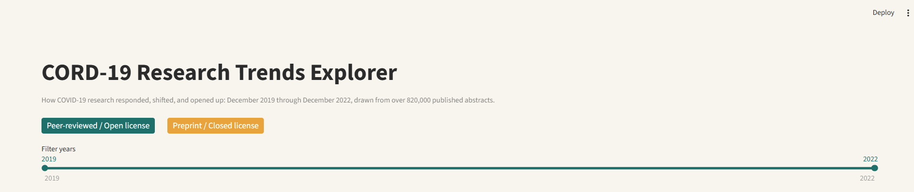
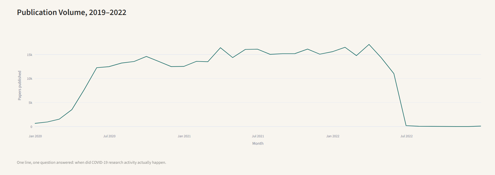
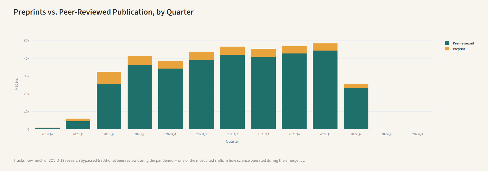
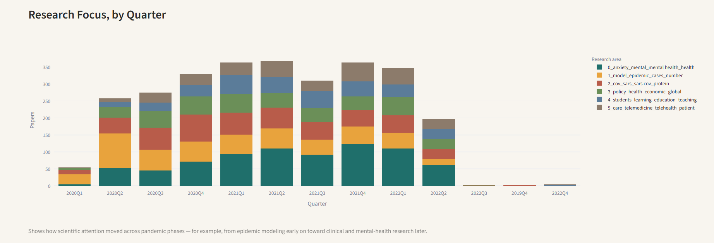
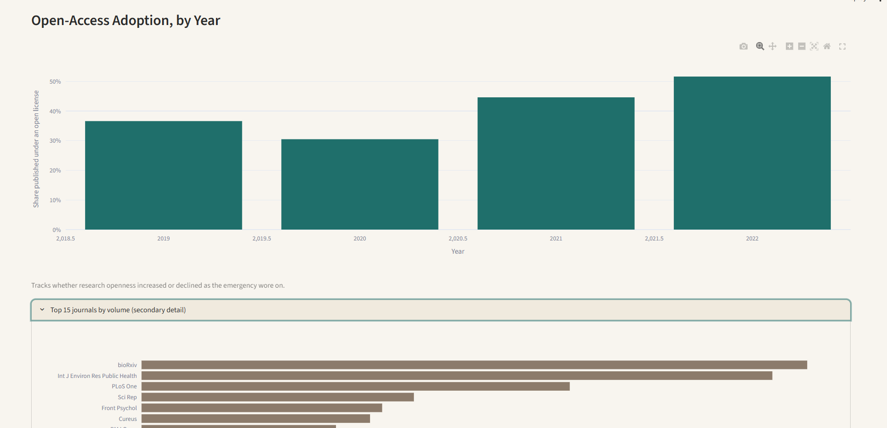
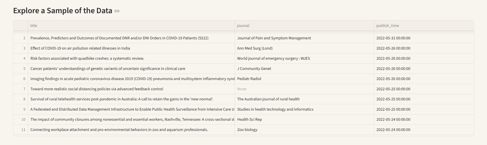

# COVID-19 Research Trends Explorer


---

## What this project is

An analysis of over 375,000 COVID-19 research paper abstracts, published between December
2019 and December 2022, drawn from the CORD-19 dataset — a collection of more than a million
scholarly records compiled by the Allen Institute for AI, the Chan Zuckerberg Initiative, and
a coalition of medical and research institutions in coordination with the White House Office
of Science and Technology Policy.

This is not a chart of trivia. Each visual in this dashboard is built to answer a question a
research policy analyst, a funder, or a public-health strategist would actually ask: did
science keep up with the pandemic, did it move faster than peer review could verify, where
did research attention go as the emergency evolved, and did openness in science hold up under
pressure.

**[Try the live app →](https://YOUR-APP-LINK.streamlit.app)**

---

## The problem

A million-plus research records is not information — it's raw material that has to be shaped
before it means anything to a reader:

- The full archive is 20GB across 400,000+ individual full-text files — far more than is
  needed, and easy to overload a normal computer with if handled without a clear scope.
- Even the lighter metadata file, at over 800,000 rows, is too large to filter or explore live
  without heavy delays — every interaction with raw, ungrouped data means re-scanning hundreds
  of thousands of rows.
- Nothing in the raw data answers a real question on its own. Publication counts, licensing
  codes, and journal names sitting in a spreadsheet don't tell a reader whether science
  responded quickly, whether peer review kept pace, or what the research community was
  actually working on at any given point in the pandemic.

## The solution

Rather than filtering a massive dataset live, this project follows the same principle used in
SQL data warehousing: aggregate once, store the small result, and let every later interaction
run against that small result instead of the raw data.

1. **Scope to the period that matters.** Work is bounded to December 2019 through December
   2022 — the active pandemic window — rather than diluting the analysis with unrelated years.
2. **Aggregate once, store small.** Every chart in this dashboard is backed by a precomputed
   summary table, most under a few hundred rows, instead of the 375,000+ underlying records.
   This is what makes the dashboard load and filter instantly.
3. **Classify meaningfully, not just count.** Publications are classified as preprint versus
   peer-reviewed, and by license openness — categories that carry real weight in how research
   is trusted and used, not just descriptive counts.
4. **Model the subject matter.** A transformer-based topic model groups abstracts into their
   actual research subjects, so "what was the science community focused on" has a real,
   data-driven answer instead of a guess.
5. **Present with restraint.** Each chart answers exactly one question, in one color family,
   sorted so the most significant value is always the most visually prominent one.

## Why I built it

Most portfolio projects stop at counting rows. I wanted to practice the harder, more valuable
skill: taking an unwieldy dataset and asking what a decision-maker in this space would actually
need to know from it — how fast research responded, whether it outran the normal safeguards of
peer review, and whether scientific openness held up during an emergency. Those are the
questions this dashboard is built to answer, not just illustrate.

---

## A tour of the dashboard

Save each screenshot from the live app into `assets/screenshots/` using the exact filename
listed under each image below — the README is already wired to those paths.

### 1. Overview

The dashboard opens with a color key defining what each recurring color represents, before
any chart appears, so no chart later requires guessing what a color means.

### 2. Publication Volume

Monthly publication counts across the pandemic window, showing when research activity
actually accelerated and when it leveled off.

### 3. Preprints vs. Peer-Reviewed Publication

Tracks how much of COVID-19 research bypassed traditional peer review during the emergency —
one of the most consequential and widely discussed shifts in how science operated during the
pandemic.

### 4. Research Focus by Quarter

The research community's actual subject-matter focus, grouped automatically by topic and
tracked by quarter, showing how scientific attention moved as the pandemic progressed.

### 5. Open-Access Adoption

The share of research published under an open license each year — a direct, policy-relevant
measure of how open science stayed under sustained pressure.

### 6. Explore the Data

A browsable sample of the underlying papers for anyone who wants to look past the aggregate
view.

---

## Repository structure

```text
cord19-research-explorer/
│
├── data/
│   ├── metadata.csv                        # Raw file, downloaded separately (see Setup)
│   ├── summary_monthly_volume.csv          # Precomputed: ~37 rows
│   ├── summary_pubtype_quarterly.csv       # Precomputed: ~24 rows
│   ├── summary_license_yearly.csv          # Precomputed: ~8 rows
│   ├── summary_topic_quarterly.csv         # Precomputed: ~30 rows
│   ├── summary_top_journals.csv            # Precomputed: 15 rows
│   └── summary_browse_sample.csv           # Precomputed: 2,000-row sample
│
├── notebooks/
│   ├── 01_load_and_clean.ipynb
│   ├── 02_eda.ipynb
│   ├── 03_text_mining.ipynb
│   ├── 04_topic_modeling.ipynb
│   └── 05_precompute_summaries.ipynb       # Builds every file the dashboard reads
│
├── assets/
│   └── screenshots/
│       ├── 01-overview.png
│       ├── 02-publication-volume.png
│       ├── 03-preprint-vs-peer-reviewed.png
│       ├── 04-research-focus.png
│       ├── 05-open-access-adoption.png
│       └── 06-explore-data.png
│
├── app.py                                  # The Streamlit dashboard
├── requirements.txt
├── .gitignore
└── README.md
```

---

## What's under the hood (for the technically curious)

| Stage | What happens | Tools |
|---|---|---|
| **Ingest** | Load only the metadata file, selecting 9 of 19 columns with explicit dtypes | Pandas |
| **Scope** | Bound to the active pandemic window (Dec 2019–Dec 2022) | Pandas |
| **Classify** | Preprint vs. peer-reviewed by source; open vs. closed by license code | Pandas |
| **Model** | Transformer-based topic modeling on a representative 15,000-abstract sample | BERTopic, scikit-learn |
| **Precompute** | Every chart's data aggregated once into small summary tables (a materialized-view pattern borrowed from SQL) | Pandas |
| **Serve** | A dashboard that reads only the small precomputed tables — never the raw 375,000+ rows — so filtering is instant | Streamlit, Plotly |

## Key findings

- **375,727** papers were published within the active pandemic window (December 2019
  through December 2022).
- Publication volume peaked in **March 2022**, at **17,115 papers** in that single month.
- **11.2%** of publications were preprints rather than peer-reviewed. This share was highest
  early in the pandemic — **24.6%** in Q1 2020 — and declined steadily to roughly **9%** by
  mid-2022, suggesting the research community leaned on preprints most heavily during the
  earliest, most urgent phase of the response, before shifting back toward standard peer
  review as the emergency matured. (The dataset's final two quarters, 2022Q3–Q4, contain too
  few records to include in this trend.)
- **41.5%** of publications were released under an open license overall. This share rose
  steadily across the pandemic — from **30.5%** in 2020, to **44.6%** in 2021, to **51.6%**
  in 2022 — showing open-access publication became more common, not less, as the emergency
  wore on.
- **Mental health and anxiety** research accounted for the largest overall share of
  publications, and became the dominant research focus from early 2021 onward. Earlier in
  the pandemic, attention was led first by **epidemic modeling** (early 2020) and then by
  **virus biology and SARS-CoV-2 protein research** (mid-to-late 2020) — showing the research
  community's focus moved from understanding and tracking the virus itself toward its
  psychological and societal impact as the pandemic continued.

---

## Setup

```bash
git clone https://github.com/YOUR_USERNAME/cord19-research-explorer.git
cd cord19-research-explorer
python -m venv venv
venv\Scripts\Activate.ps1
pip install -r requirements.txt

kaggle datasets download -d allen-institute-for-ai/CORD-19-research-challenge -f metadata.csv
Expand-Archive metadata.csv.zip -DestinationPath data
```

Then run the notebooks in order, once, to build the precomputed summary files:
`01_load_and_clean.ipynb` → `02_eda.ipynb` → `03_text_mining.ipynb` → `04_topic_modeling.ipynb`
→ `05_precompute_summaries.ipynb`.

Finally, launch the dashboard:
```bash
streamlit run app.py
```

## Data attribution

Dataset: CORD-19 Open Research Dataset, created by the Allen Institute for AI in partnership
with the Chan Zuckerberg Initiative, Georgetown University's Center for Security and Emerging
Technology, Microsoft Research, IBM, and the National Library of Medicine (NIH), in
coordination with the White House Office of Science and Technology Policy.

---

## Author

**Ajibola Odeyemi**
*- Specialist in Quantitative & Qualitative Analytics*

Built to demonstrate an end-to-end workflow: a massive, unscoped research archive in, a
focused, decision-relevant dashboard out.
